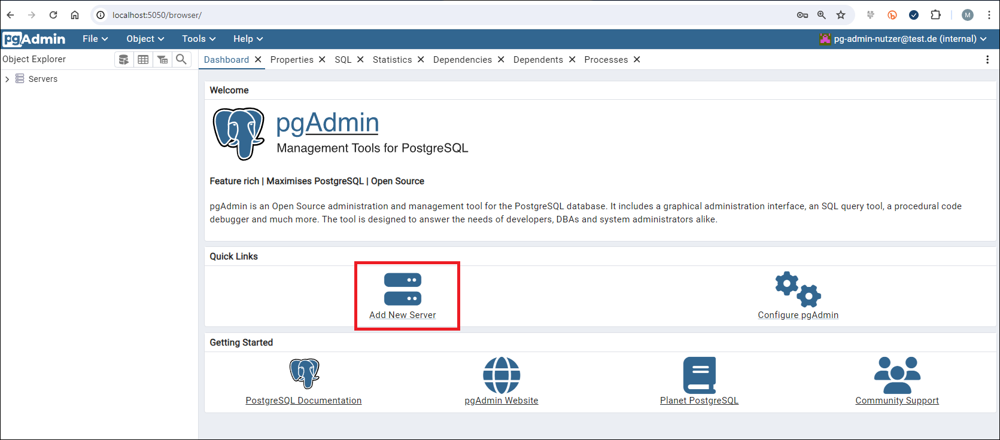
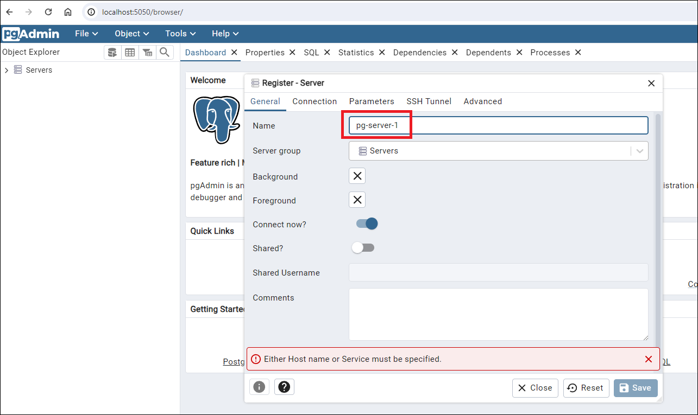
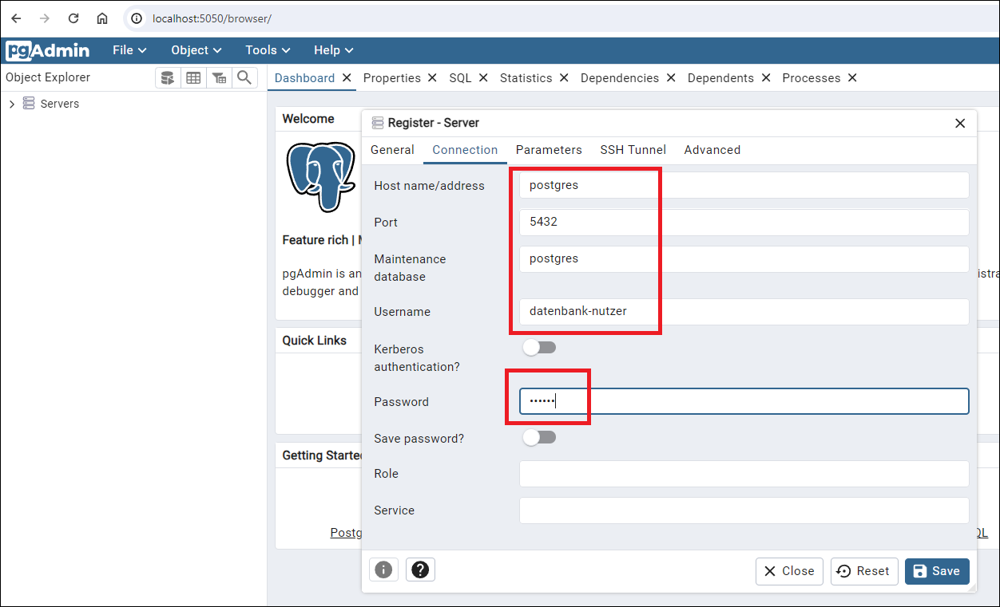
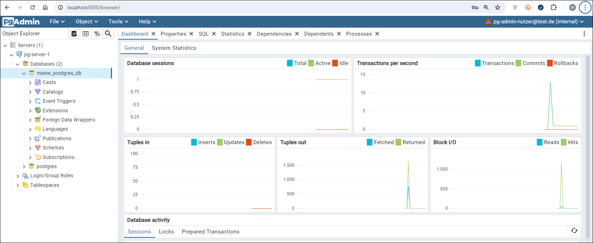
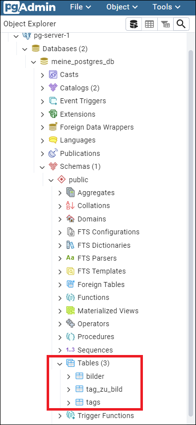
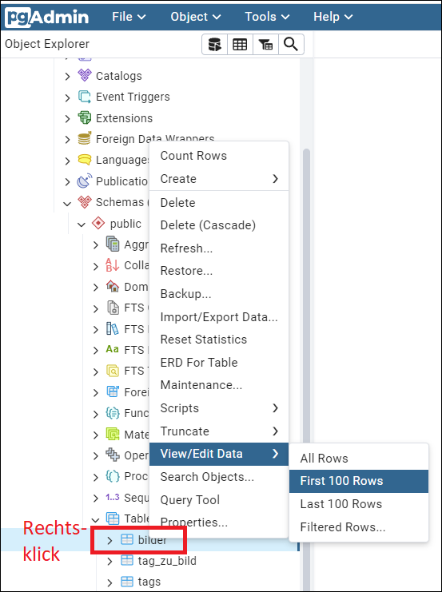
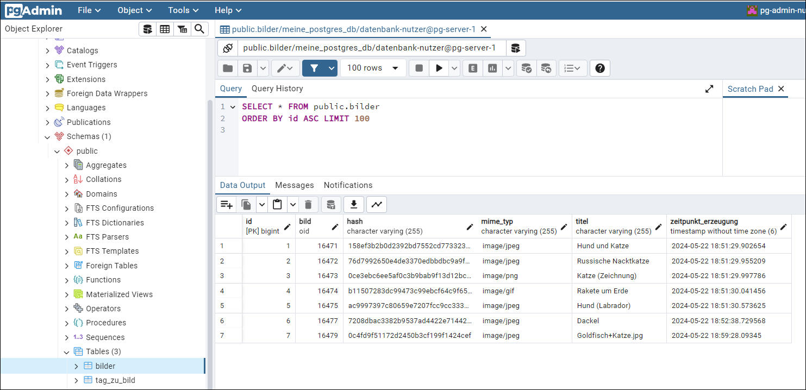

# Anwendung gegen Postgres-Datenbank in Docker-Container laufen lassen #

<br>

Default-mäßig läuft die Anwendung gegen die eingebettete H2-Datenbank.
Wenn die Anwendung mit dem Spring-Profil `postgres` ausgeführt wird, dann
wird die Verbindung zu einer lokal laufenden Postgres-Instanz aufgebaut,
welche in der Datei `application-postgres.properties` definiert ist.
Für den Start der Anwendung mit diesem Profil gibt es im Wurzelverzeichnis
die Start-Skripte `maven_start_postgres.bat` (Windows) und
`maven_start_postgress.sh`(MacOS+Linux).

<br>

Die hierfür benötigte lokale Postgres-Instanz kann mit Docker-Compose gestartet werden.
Hierzu ist im aktuellen Ordner der folgende Befehl auszuführen:

```
docker-compose up
```

<br>

**Weitere Befehle:**
* Container anhalten   : `docker-compose stop`
* Container neu starten: `docker-compose start`
* container löschen    : `docker-compose down`

<br>

----

## pgAdmin ##

Die Datei [docker-compose.yml](docker-compose.yml) in diesem Ordner startet auch
noch einen Container mit der Web-Admin-Oberfläche [pgAdmin](https://www.pgadmin.org/).
Diese ist nach erfolgreichem Start unter der folgenden URL erreichbar: http://localhost:5050/
Die Anmeldedaten stehen in der Datei `docker-compose.yml`, siehe Einträge `PGADMIN_DEFAULT_EMAIL`
und `PGADMIN_DEFAULT_PASSWORD`.

<br>

Siehe auch den [Artikel "Setting up PostgreSQL and Pgadmin4 instance infrastructure using Docker Compose" auf *medium.com*](https://medium.com/towards-data-engineering/running-a-postgresql-and-pgadmin4-instance-using-docker-compose-c6dd6e6e03bb).

<br>

Die Screenshots unten zeigen, wie man dann die Verbindung zu Postgres-Instanz im anderen Container konfiguriert.
Das hierfür benötige Passwort ist ebenfalls in der Datei `docker-compose.yml` definiert, siehe den Eintrag `POSTGRES_PASSWORD`.

<br>



<br>



<br>

Auf dem Tab "Connection" müssen wir für "Host name/adress" den Wert "postgres" (Container-Name!) statt "localhost" eingeben, weil *pgAdmin* die in einem anderen
Container laufende Postgres-Instanz finden soll.



<br>



<br>

Da erfolgreichem Start der Anwendung "Bildergallerie" mit dem Profil `postgres`
sollen sich die drei Tabellen dieser Anwendung an der folgenden Stelle finden:



<br>



<br>



<br>
